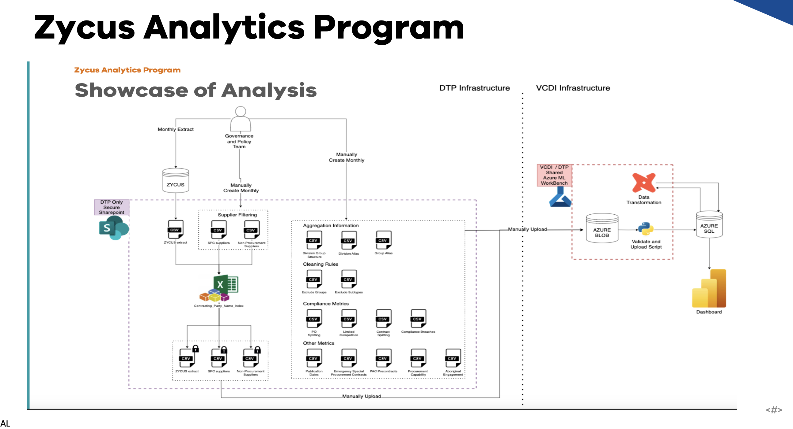
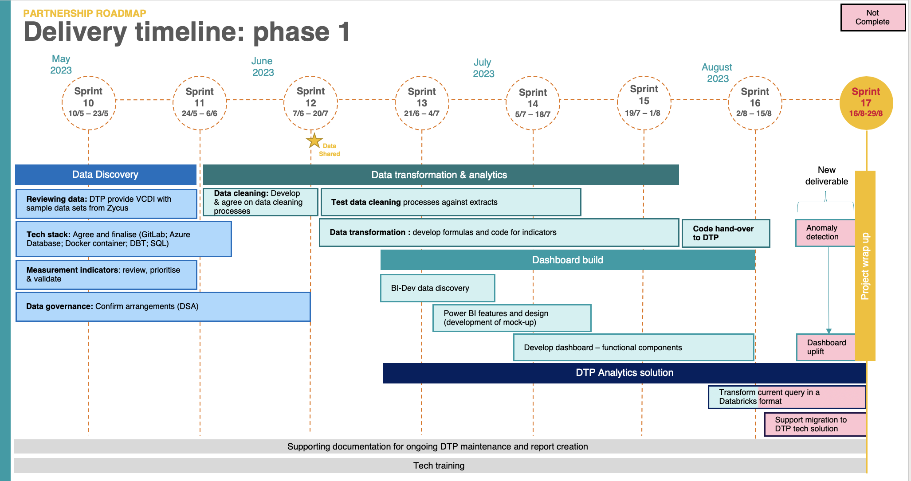

```{r setup, include=FALSE}
knitr::opts_chunk$set(echo = FALSE, message = FALSE, warning = FALSE)
```

```{r}
library(tidyverse)
library(kableExtra)
datades <- read_csv("datatype.csv")
``` 

# Abstract

The Victorian Center for Data Insights (VCDI) is at the forefront of transforming how the Victorian Government utilizes data to enhance policies and services for the citizens of Victoria, Australia. In collaboration with the Department of Transport and Planning (DTP), this project, known as the Zycus Analysis Program (ZAP), is a remarkable endeavor aimed at advancing the understanding of existing procurement data and improving data analytics practices.

The primary goal of the ZAP project is to empower the DTP with actionable insights into its procurement processes. By utilizing data analytics, it seeks to enable DTP to construct informative reports showcasing key procurement metrics. These metrics are vital for ongoing measurement and monitoring of procurement performance, which, in turn, supports more efficient policy implementation and service delivery. Moreover, this initiative strives to address policy, legislative, and service delivery risks proactively.

The project is grounded in an Agile workflow that fosters flexibility, collaboration, and continuous improvement. Agile practices guide every aspect of the project, from development to feedback integration. In bi-weekly sprints, the project team closely collaborates with the DTP to ensure alignment with the client's evolving needs and requirements. The project's progress and tasks are meticulously managed using the Jira project management software.

Two machine learning models, the Isolation Forest and the Local Outlier Factor (LOF), have been employed for this purpose. The Isolation Forest excels in capturing high-value anomalies, while the LOF model excels in detecting both high and low-value anomalies. Combining the results of both models using the AND logic creates a robust detection system that ensures data integrity. The detection process is also highly adaptable, with the contamination factor as a variable that can be adjusted as per DTP's needs.

Ultimately, the project aims to deliver a comprehensive set of anomalies common to both the Isolation Forest and LOF models. These anomalies are populated into a SQL table named "anomaly" and will be integrated into an existing Power BI dashboard. This dashboard, viewable by DTP officials, will provide valuable insights into procurement data.

# About Victorian Center for Data Insights (VCDI)

To improve policies and services for all Victorians, VCDI was created to change how the Victorian Government uses data. The Victorian Government gathers a lot of data, including information on business, communities, infrastructure, and the environment, in addition to data on education and health. To assist Victorian public service organisations in achieving this, we provide the following support:
* Services for the future: aid in developing a vision and plan to become more data-driven 
* Integrated Support and Training: utilising data to provide coaching and development opportunities for workers and teams
* Analytics Services: Collaborating on data analytics initiatives that enhance quality of life or result in more efficient resource use.

Additionally, the Victorian Government may share data thanks to VCDI in order to better coordinate efforts to address important community needs. Our work depends on community trust, and we adhere to strict guidelines around data sharing, security, and privacy. The Chief Data Officer, a formal position established by the 2017 Victoria Data Sharing Act, is in charge of us. 
Only when this information aids in better decision-making is it worthwhile. Every area of policy and service delivery can benefit from the Victorian Government using data more effectively. It may offer new perspectives on how our health, education, and transportation systems operate. It can show what makes for secure communities that offer residents employment and financial opportunity. It can help us manage our environment and public spaces. (Victorian Centre for Data Insights, 2023)


# About DTP (Client)

The **Department of Transport and Planning (DTP)** is a government department in Victoria, Australia. It started its operations in 2019 as **Department of Transport**. The department is responsible for ongoing operation and coordination of the state's transport networks, as well as the delivery of new and upgraded transport infrastructure. It also absorbed most functions of VicRoads and Public Transport Victoria on 1 July 2019. On 1 January 2023, after the 2022 Victorian state election, the department absorbed the planning functions of Department of Environment, Land, Water and Planning and was renamed to its current name.

# About the project

DTP and VCDI will align on the project objectives to ensure we can work as one team towards a common vision. Zycus Analysis Program (ZAP) project must Improve access and  understanding of existing procurement data and uplift data analytics practices so that Reports can be built to display key procurement metrics for ongoing measurement and monitoring of  procurement performance in order to Enable proactive access across DTP. procurement practices and mitigate  policy, legislative and service delivery risks by providing regular management information that can be easily. The **goal of the project** is to uplift DTP analytics capability in order to develop accessible, reliable and up-to-date reporting dashboards of procurement insights which can be viewed across different teams and branches in DTP.

 

# Objectives 

After joining VCDI after sprint 17, our objective was to complete the **Anomaly Detection** deliverable of the ZAP Anomaly project. VCDI worked in an Agile Environment. Agile workflow refers to managing and completing projects emphasizing flexibility, collaboration, and continuous improvement. It is based on the Agile software development methodology and is characterized by iterative and incremental delivery, adaptive planning, and delivery of working software. At each sprint, customers and stakeholders provide their feedback, which is incorporated at the end of each sprint. This method enables developers to spot problems early on and fix them in a timely manner. It also improves the project’s efficiency and ensures that the final output meets the demands of the customers and stakeholders. (Mathiarasan, 2023). The sprints were of 2 weeks duration each. After every sprint, a meeting was arranged with the client to let them know about the progress and gain their suggestions. Our progress was monitored using the JiraTM Project management software. Jira is a software application developed by the Australian software company Atlassian that allows teams to track issues, manage projects, and automate workflows. (Jira, 2022) 



 After gaining the access to the database, the **DBeaver** software was used to have a look at the datasets/tables and run some basic queries for data analysis. DBeaver is a SQL client software application and a database administration tool. (Wikipedia contributors, 2023).  The data was imported from AZURE Blob as that was the only common data share point between VCDI and DTP. 

The main aim for this project was the anomaly detection in the procurement data for DPT. The Zycus database had different tables indicating different aspects of the contracts that are submitted to the DTP. The database had many tables, but we were supposed to work on 7 tables that all signified different aspect of the contracts for example the value of contract, percentage of splitting, number of contracts etc. The anomalies the client was keen on finding are different for every table for example in the **contracts_awarded** table, the anomalies will be the contracts having very high contract values in AUD or the group that had many numbers of contracts in a month as compared to other months Etc. Some groups are expected to have very high value contracts but there exist some groups that have usually lower value contracts, if these groups suddenly have a high value contract those need to be flagged and reviewed by the DTP officials. The way how we define an observation as an anomaly is different for every table and will be discussed in detail in the later part of the report. The main motivation to do the anomaly detection was to get hold of the fraudulent contracts so that the procurement team can review the legitimacy of the contracts.  

Two machine learning models namely **Isolation Forest** and **Local Outlier Factor** were used for the anomaly detection. Then the objective was to merge both the models in a way that it satisfies the expectations of the clients. The final step was to populate the anomaly table in the database that has the all the top **n** anomalies for a month. 


## Project workflow

Workflow of ZAP included several steps depicted in Figure 1. The steps included:

* DTP uploading data to **ZYCUS** database
* Hashing the data via excel to remove personal information of contractors before handing over the data to VCDI.
* DTP manually creating aggregation information, cleaning rules and metrics. 
* All of this information was then uploaded to AZURE blob which is a feature of Microsoft Azure. It allows users to store large amounts of unstructured data on Microsoft's data storage platform. In this case, Blob stands for Binary Large Object, which includes objects such as images and multimedia files. (SnapLogic, 2023)
* Then DBT was used to transform data and python to Analyse and detect anomalies in the data. 

